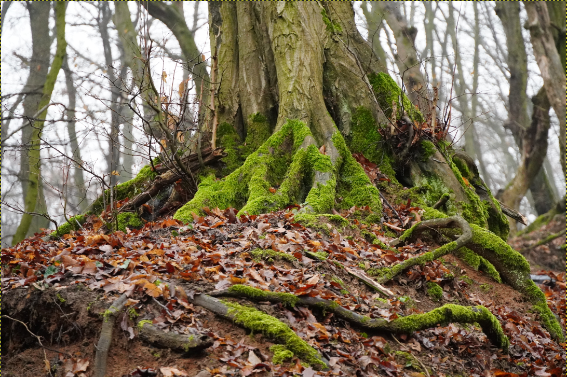
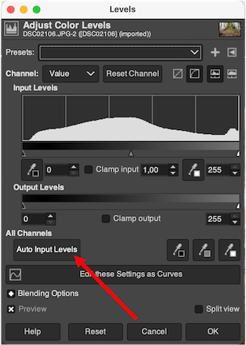

# Invoking GIMP from digiKam
GIMP is invoked in batch mode from digiKam to apply basic edits on batch of photographs.
## Motivation
I am not a professional photographer. I only take photos of the family and of the nature when I am out for hiking. So, I don’t make money from photographing. This is important when it comes to which photo organizer/editor software should I choose. I used to use Lightroom in the old times before this monthly billing period. I was quite happy with that. However, there are some downsides of Lightroom. For example, the photo enhancements are only visible in Lightroom, the original files are untouched. When I open the photo with another picture viewer the edits made in Lightroom are not seen. They advertise it as non-destructive editing, but I don’t like it.
I made a long journey in photo editing software tools since the Adobe changed its pricing model. I tried many things such as XnView MP, digiKam, rawthreapee, darktable, Corel Aftershot Pro3, ACDSee Ultimate, Apple Photos. ACDSee was perfect for me in Windows, but in Mac it has fewer features. Apple Photos is great but has the same downsides as Lightroom. Too expensive cloud fees. XnView MP is a good candidate, but I found to be so unstable and lack of important features. Good point that there are keyboard shortcuts for basic editing such as auto level and contrast. 
I own a Synology NAS and I store my files including my photos on it. So, I don’t want to pay twice for cloud services just for doing the same job. I’d like to store my photos on my NAS. 
It may sound a little bit unorthodox these days, but image edits should be destructive, which ensures that when the image file is opened by whatever program, the same enhanced image is shown. 
Finally, I turned to, my old favorite, digiKam. Although editing image in digiKam is a pain, but its organizing features are supreme. So, I decided to use its Mac version. On the other hand, GIMP can do a decent job when it comes to image editing. So, I started using it for basic image enhancements such as auto level, s-curve, and sharpening. I apply these basic edits for all newly imported photos, which a quite daunting task opening each photo in GIMP one-by-one and applying the same edits. So here is how I automated this task. This guide focuses on how to setup this in Mac but can easily be adopted to Windows or Linux as well.

## Install GIMP and digiKam
First of all, you should install digiKam and GIMP on your system. I like doing this in Mac using Home Brew.
```
> brew install --cask gimp
> brew install --cask digikam
```
As of writing this tutorial digiKam and GIMP versions are 7.9.0 and 2.10.32 (revision 1) respectively.

## Enhancements in GIMP
Experiment your favorite enhancement steps to execute in GIMP UI. Here are my steps.
The original image.



1. Auto level (`Colors/Levels`)




Sometimes the result is just slightly different from the original, but still, this is an important enhancement.

2.	Curve adjustment (`Colors/Curves`)


A little S-shaped color curve makes the photo look better.


3.	Sharpening (`Filters/Enhance/Sharpen (Unsharp Mask)`)


This is just basic editing for all imported images, so don’t overdo it. Just a slight sharpening is fine.


These are the steps that works for me. You can experiment what works for you. Once you have the sequence of edits you would like to apply to your photos, the next step is to automate it. This means we will use GIMP’s scripting ability, so no need to open GIMP UI again. The sequence of GIMP commands will be executed from command line without mouse clicking. This command will be integrated to digiKam workflow later. 

## Setup GIMP script
As a first step of automation, we implement a script, which executes the three editing steps described above, at once. A menu item will be created for then in GIMP called `Image/Basic enhance`. This is a custom menu item having our editing steps scripted behind it.


We compile our enhancement steps experimented before in GIMP’s [script language](./gimp_scripts/BasicEnhance.scm).

```
> cat /Users/username/Library/Application Support/GIMP/2.10/scripts/BasicEnhance.scm
(define (script-fu-basic-enhance image layer)
    (gimp-image-undo-group-start image)
    (gimp-levels-auto layer)
    (gimp-drawable-curves-spline layer HISTOGRAM-VALUE 10 #(0 0 40 30 128 128 216 226 255 255))
    (plug-in-unsharp-mask RUN-NONINTERACTIVE image layer 3 0.5 0.2)
    (gimp-image-undo-group-end image)
    (gimp-displays-flush)
)

(script-fu-register
    "script-fu-basic-enhance"
    "<Image>/Image/Basic enhance"
    "Automatic level, s-curve, and sharp."
    "kipe"
    "(c) kipe"
    "Jan 2023"
    "RGB*, GRAY*"
    SF-IMAGE "Image" 0
    SF-DRAWABLE "Layer" 0
)
```

Run `Filters/Script-Fu/Refresh Scripts` command in GIMP after `BasicEnhance.scm` file above is placed to the scripts folder. Basic enhance menu item will show up in Image menu.
The situation has improved much because we were able to implement a script which makes all the enhancement steps at once, and we created a menu item for it in GIMP. So, we can make all the edits with just a single click, but we still need to open all the photos in GIMP one-by-one and click and save. The next step is to invoke GIMP in batch mode in command line.

## Run GIMP in batch mode
We have a GIMP script, and it is assigned to a menu item on the UI. However, we still need to open GIMP to make adjustments. If we plan to invoke this photo enhancement script from digiKam Batch Queue Manager, we should avoid opening GIMP, we will use GIMP batch mode from CLI (`gimp -b`).

The previous GIMP script interacts with the current opened photo object. However, we need to apply the enhancements script on a given input photo file and save the result to an output photo file. To achieve this, we need to create another GIMP script. Let’s call this [BasicEnhanceCli.scm](./gimp_scripts/BasicEnhanceCli.scm) and put it o the same scripts folder as before.

```
> cat /Users/username/Library/Application Support/GIMP/2.10/scripts/BasicEnhanceCli.scm
(define (basic-enhance-cli in_filename out_filename)
    (let* (
        (image (car (gimp-file-load RUN-NONINTERACTIVE in_filename in_filename)))
        (drawable (car (gimp-image-get-active-layer image))))
        (script-fu-basic-enhance image drawable)
        (gimp-file-save RUN-NONINTERACTIVE image drawable out_filename out_filename)
        (gimp-image-delete image)
    )
)
```
Once it is ready, you can test the newly created script in terminal.

```
> /Applications/GIMP.app/Contents/MacOS/gimp -idf -b "(basic-enhance-cli \"input.jpg\" \"output.jpg\")" -b "(gimp-quit 0)"
```

Problem

You have a writable data folder configured (/Users/user/Library/Application Support/GIMP/2.10/gradients), but this folder does not exist. Please create the folder or fix your configuration in the Preferences dialog's 'Folders' section.

Solution

Go to folder /Users/user/Library/Application Support/GIMP/2.10/ and create gradient folder.

## Integrate to digiKam
At this point we implemented our selected photo enhancement steps into a GIMP script, assigned it to a menu item and able to run it in batch mode. Now it’s time to integrate it into our favorite photo management software, digiKam.

There is a way to run shell script edits on photographs in digiKam. You can type your shell script into `User Shell Script` in `Batch Queue Manager` as shown in figure below.


`$INPUT` and `$OUTPUT` are special variables here which are replaced by original and target file names shown on the left-hand side plane.
You copy and paste [this](./bash_scripts/basic_enchance.sh) shell script to digiKam.

```
#!/bin/bash
/Applications/GIMP.app/Contents/MacOS/gimp -idf -b "(basic-enhance-cli \"$INPUT\" \"$OUTPUT\")" -b "(gimp-quit 0)"
```

It should work like a charm.


You can save this workflow for later use by right clicking on User Shell Script in the middle.


## References

https://www.gimp.org/

https://brew.sh/

https://www.xnview.com/en/xnviewmp/

https://www.youtube.com/watch?v=ZoMMZeT8frM


